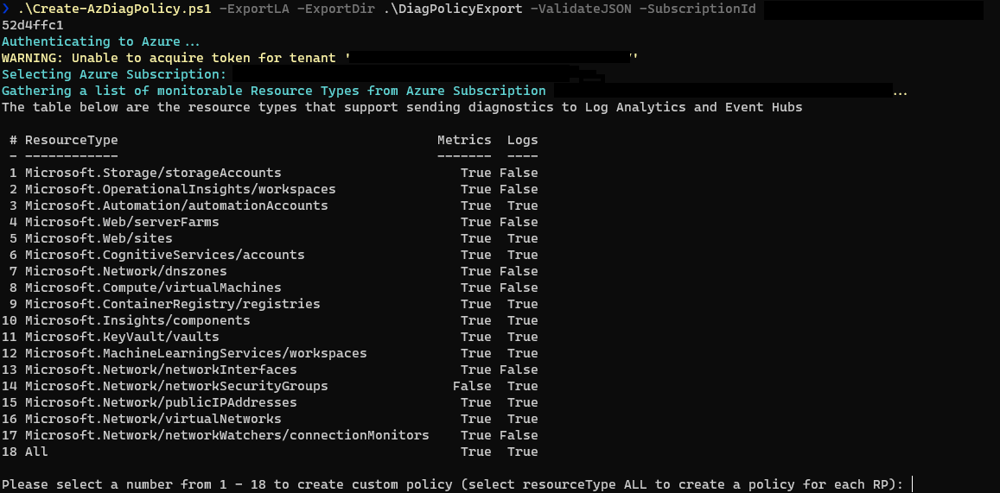

## Built-in Policy

Examples of built-in policies.

- [Allowed VM size SKU](https://github.com/Azure/azure-policy/blob/master/built-in-policies/policyDefinitions/Compute/VMSkusAllowed_Deny.json)

- [Enable Azure Security Center on your subscription](https://github.com/Azure/azure-policy/blob/master/built-in-policies/policyDefinitions/Security%20Center/ASC_Register_To_Azure_Security_Center_Deploy.json)

- [Deploy Log Analytics agent for Linux VMs](https://github.com/Azure/azure-policy/blob/master/built-in-policies/policyDefinitions/Monitoring/LogAnalyticsExtension_Linux_VM_Deploy.json)

For more built-in polices, see [https://docs.microsoft.com/en-us/azure/governance/policy/samples/built-in-policies](https://docs.microsoft.com/en-us/azure/governance/policy/samples/built-in-policies) for more information.

> To enable OS metrics in Log Analytics, see [documentation](https://docs.microsoft.com/en-us/azure/azure-monitor/learn/quick-collect-linux-computer)

## Sample Custom Policy

> Sample policies at github: https://github.com/Azure/azure-policy/tree/master/samples/Monitoring

### NSG flow log

For NSG flow log, see https://learn.microsoft.com/en-us/azure/network-watcher/nsg-flow-logs-policy-portal

### WAF log

> Updated for new `Diagnostics` ARM template. See the [document](https://learn.microsoft.com/en-us/azure/templates/microsoft.insights/diagnosticsettings?pivots=deployment-language-arm-template) for more information.

this policy _deploy-if-not-exist_ WAF log (`ApplicationGatewayAccessLog`, `ApplicationGatewayPerformanceLog`, `ApplicationGatewayFirewallLog`) to Log Analytics account

## CLI

CLI to create policy definition

```powershell
Get-Content .\policy-deploy-waf-log.json | ConvertFrom-Json | % { $_.parameters } | ConvertTo-Json -Depth 15 > _params.json
Get-Content .\policy-deploy-waf-log.json | ConvertFrom-Json | % { $_.policyRule } | ConvertTo-Json -Depth 15 > _rules.json

az policy definition create --name 'test-deploy-waf-log' `
    --mode all --rules _rules.json `
    --params _params.json `
    --metadata "category=test" `
    --subscription $subscriptionid
```

> Reference: https://docs.microsoft.com/en-us/cli/azure/policy/definition?view=azure-cli-latest

## PowerShell Tool for Diagnostics Policy

`Create-AzDiagPolicy` is a tool that enables Azure diagnostics in your subscription.

https://www.powershellgallery.com/packages/Create-AzDiagPolicy

```powershell
save-script -name create-azdiagpolicy -Path . -Repository PSGallery

get-help .\Create-AzDiagPolicy.ps1 -example

.\Create-AzDiagPolicy.ps1 -ExportLA -ExportDir .\DiagPolicyExport -ValidateJSON -SubscriptionId "{subscription id}"
```


