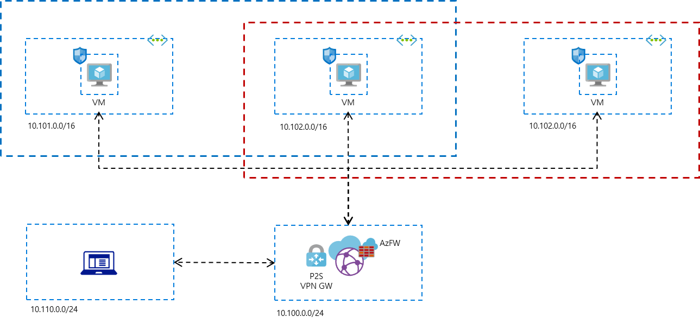

# Network

Hub-spoke network Architecture



## P2S VPN Prep

In order to setup P2S VPN, you would need to generate root and client certificate. Run following commands to generate certificates then export them to `PS2RootCert.cer` and `PSChildCert.pfx` repectively.

```powershell
$cert = New-SelfSignedCertificate -Type Custom -KeySpec Signature
    -Subject "CN=PS2RootCert" -KeyExportPolicy Exportable `
    -HashAlgorithm sha256 -KeyLength 2048 `
    -CertStoreLocation "Cert:\CurrentUser\My" -KeyUsageProperty Sign -KeyUsage CertSign

New-SelfSignedCertificate -Type Custom -DnsName P2SChildCert -KeySpec Signature `
    -Subject "CN=PS2ChildCert" -KeyExportPolicy Exportable `
    -HashAlgorithm sha256 -KeyLength 2048 `
    -CertStoreLocation "Cert:\CurrentUser\My" `
    -Signer $cert -TextExtension @("2.5.29.37={text}1.3.6.1.5.5.7.3.2")
```
> For more information, see this [link](https://www.golinuxcloud.com/configure-azure-point-to-site-vpn-connection)

## Network Setup

To run this script, you need to update variables in `variables.tf` or create a new `override.tf`.

To run terraform,

```
terraform init
terraform validate
terraform apply
```

After provision is completed, __download VPN client__ and setup VPN connection.

### Config routing for VPN

Select all routes including `rt-blue` and `rt-red` in __Propagate routes from all branch connections to these labels across virtual WAN__ setting.

### Allow ICMP on your PC

For testing ping from cloud to PC, you need to allow ICPM inbound in Windows firewall.

1. **Open Windows Defender Firewall with Advanced Security**:
   - Press `Win + R` to open the Run dialog.
   - Type `wf.msc` and press Enter.

2. **Create a New Inbound Rule**:
   - In the left pane, click on **Inbound Rules**.
   - In the right pane, click on **New Rule**.

3. **Configure the Rule**:
   - Select **Custom** and click **Next**.
   - Choose **All programs** and click **Next**.
   - In the **Protocol type** dropdown, select **ICMPv4** (or ICMPv6 if you're using IPv6).
   - Click **Customize**.
   - Select **Specific ICMP types** and check **Echo Request**.
   - Click **OK** and then **Next**.

4. **Specify IP Addresses**:
   - Choose **Any IP address** for both local and remote addresses, or specify particular IP addresses if needed.
   - Click **Next**.

5. **Allow the Connection**:
   - Select **Allow the connection** and click **Next**.

6. **Apply the Rule to Profiles**:
   - Choose the profiles (Domain, Private, Public) where you want the rule to apply.
   - Click **Next**.

7. **Name the Rule**:
   - Give the rule a name (e.g., "Allow ICMP Echo Request") and click **Finish**.

## Isolate VNETs

https://learn.microsoft.com/en-us/azure/virtual-wan/scenario-isolate-vnets-custom
