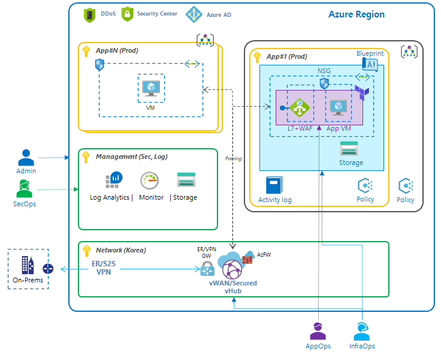

# README

>❗RBAC, Policy and Terraform updated to latest version.

This sample demonstrates how to setup Azure landing zone. This landing zone provides following governing concept. 

- Centralized logging/monitoring to Storage account/Log Analytics
- Baseline policies (e.g., enable ASC, enforce logging and optimizing cost) using _Azure Policy_
- Automate landing zone using _Azure Blueprint(basic)_ and _Terraform(advanced)_

> Prerequisites: _Storage account_ and _Log Analytics_ are required for centralized log.

## RBAC

Provide basic roles for the landing zone environment.

- Admin: Management group and subscription lifecycle management 
- NetOps: Platform-wide global connectivity management: VNets, UDRs, NSGs, NVAs, VPN, ExpressRoute, and others
- SecOps: Security administrator role with a horizontal view across the entire Azure estate and the Azure Key Vault purge policy
- InfraOps: Delegated role for subscription owner derived from subscription owner role
- AppOps: Contributor role granted for application/operations team at resource group level

## Azure Policy

Set baseline policies in subscription/management group scope for the landing zone.

- Cost optimization, enforce only certain VM SKU can be deployed in this subscription
- Security, enable ASC
- Centralized log (logs are stored in central location of Log Analytics or Storage account):
    - WAF log: automatically enable WAF log
    - OS(VM) log: syslog and metrics

> For centralize log, you can also add platform logs, including Activity log and AAD log.

## Azure Blueprint

Build basic infrastructure landing zone.

- Resource group
- Virtual network with 5 subnets, including `AppGWSunet` and `CoreSubnet`
- NSGs
- Lock resources (vnet and NSGs)
- Storage account

## Terraform

Deploy application landing zone.

- App Gateway with complex configuration, including HTTP and HTTPs config.
- VMs with NGNIX setup

