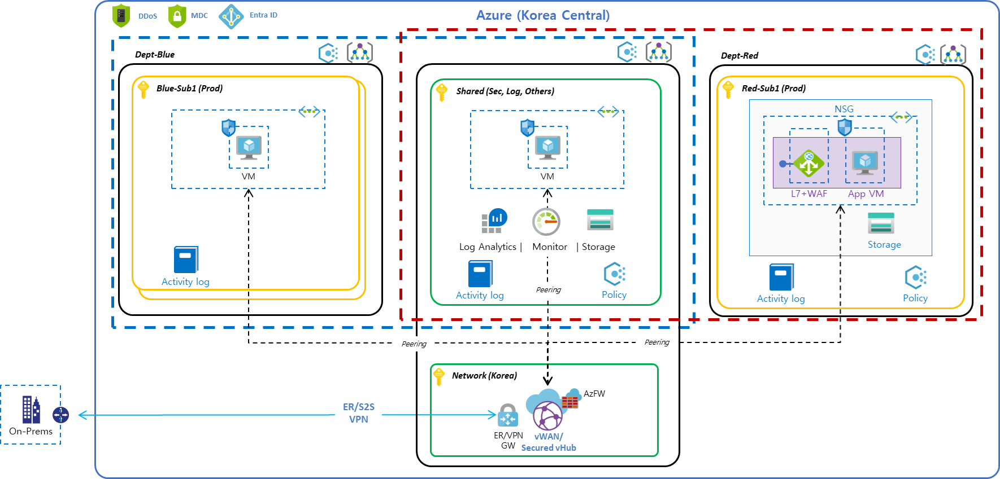

# README

This sample demonstrates how to setup Azure landing zone. This landing zone provides following governing concept. 

- Centralized logging/monitoring to Storage account/Log Analytics
- Baseline policies (e.g., enable MDC, enforce logging and optimizing cost) using _Azure Policy_
- Hub-spoke network architecture with Azure Virtual WAN.

> Prerequisites: _Storage account_ and _Log Analytics_ are required for centralized log.

## RBAC

Sample custom roles for the landing zone environment.

- Admin: Management group and subscription lifecycle management 
- NetOps: Platform-wide global connectivity management: VNets, UDRs, NSGs, NVAs, VPN, ExpressRoute, and others
- SecOps: Security administrator role with a horizontal view across the entire Azure estate and the Azure Key Vault purge policy
- InfraOps: Delegated role for subscription owner derived from subscription owner role
- AppOps: Contributor role granted for application/operations team at resource group level

## Azure Policy

Sample baseline policies in subscription/management group scope for the landing zone.

- Cost optimization: enforce only certain VM SKU can be deployed in this subscription.
- Security: enable MDC(Microsoft Defender for Cloud).
- Centralized log: (logs are stored in central location of Log Analytics or Storage account):
    - WAF log: automatically enable WAF log
    - OS(VM) log: syslog and metrics

> For centralize log, you can also add platform logs, including Activity log and AAD log.

## Hub-Spoke Network

Basic hub-spoke network using Azure Virtual WAN.

- fully meshed hub-spoke network
- enable P2S VPN
- configure isolated Vnets
