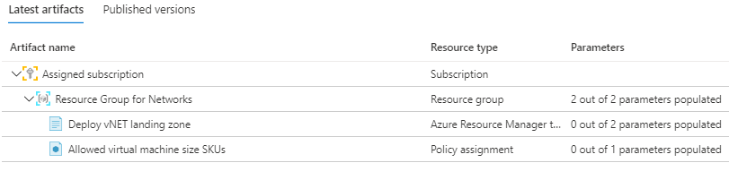

# README

Create a landing zone as below screenshot.



## Landing zone ARM template

There is two landing zone ARM template files are provided.

- [./templates/landingzone_v1.json](./templates/landingzone_v1.json): landing zone has 5 subnets, Gateway, AzureFirewall, JumpServer, AppGW, Core VNet and 2 NSGs.

- [./templates/landingzone_v2.json](./templates/landingzone_v2.json): landing zone has 5 subnets, Gateway, AzureFirewall, JumpServer, AppGW, Core VNet and 2NSGs + _Storage account_.

> Note that this sample ARM template is based on CAF landing zone template.


## Test

It is recommended to validate before update to `blueprint artifact`. 

To test ARM template (in Win10 env),

```powershell
az deployment group validate --parameters '{ ""Organization_Name"": { ""value"": ""constoso"" }, ""IPAddress_Space"": {""value"": ""10.100""} }'  --resource-group app-rg --template-file landingzone_v2.json

az deployment group what-if --parameters '{ ""Organization_Name"": { ""value"": ""contoso"" }, ""IPAddress_Space"": {""value"": ""10.100""} }'  --resource-group app-rg --template-file landingzone_v2.json
```

## CLI

> You need to install cli extension, `az extension add --name blueprint`

CLI to create blueprint

> Azure CLI does not work well, such as _adding json snippet_, in Windows/PowerShell environment. Use Cloud Shell or WSL.

```sh
az blueprint create --name 'demo-blueprint' \
    --parameters './templates/params-blueprint.json' \
    --subscription $subscriptionid

az blueprint resource-group add --blueprint-name 'demo-blueprint' \
    --artifact-name 'landingzonerg' \
    --display-name 'landing zone resource group' \
    --rg-name "[concat(parameters('Organization_Name'),'-app-rg')]" \
    --rg-location "[parameters('AzureRegion')]" \
    --subscription $subscriptionid

az blueprint artifact policy create --blueprint-name 'demo-blueprint' \
    --artifact-name 'vm-size-sku' \
    --policy-definition-id '/providers/Microsoft.Authorization/policyDefinitions/cccc23c7-8427-4f53-ad12-b6a63eb452b3' \
    --parameters './templates/params-policy.json' \
    --resource-group-art 'landingzonerg' \
    --subscription $subscriptionid

az blueprint artifact template create --blueprint-name 'demo-blueprint' \
    --artifact-name 'landing-zone-template-deploy' \
    --template './templates/landingzone_v1.json' \
    --parameters './templates/params-template.json' \
    --resource-group-art 'landingzonerg' \
    --subscription $subscriptionid

az blueprint publish --blueprint-name 'demo-blueprint' \
    --version '0.1' \
    --subscription $subscriptionid
```

> Reference: https://docs.microsoft.com/en-us/cli/azure/ext/blueprint/blueprint?view=azure-cli-latest

## PowerShell Tool for Export/Import Blueprint

You can export existing blueprint and import to other subscription/management group.

https://www.powershellgallery.com/packages/Manage-AzureRMBlueprint

```powershell
save-script -name manage-azurermblueprint -Path . -Repository PSGallery

get-help .\Manage-AzureRMBlueprint.ps1 -Examples

#import from existing blueprint
.\Manage-AzureRMBlueprint.ps1 -Mode Export -ExportDir .\_bp -BlueprintMode Subscription -SubscriptionId $subscriptionid
```
Form more detail, see https://www.youtube.com/watch?v=SMORUIPhKd8&feature=youtu.be